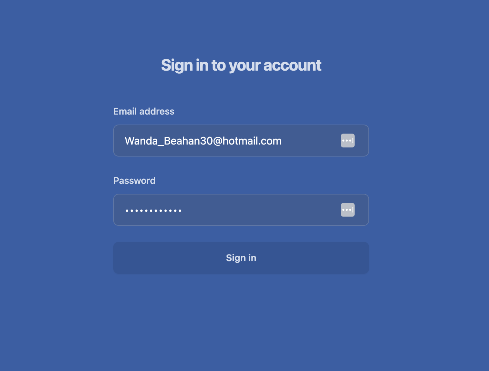
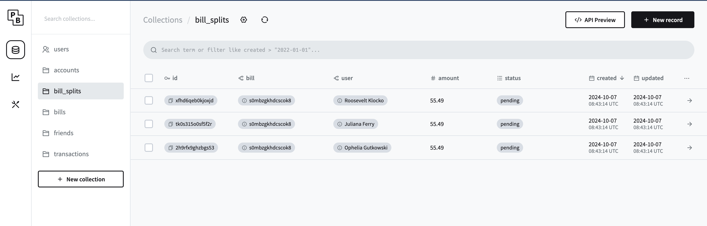
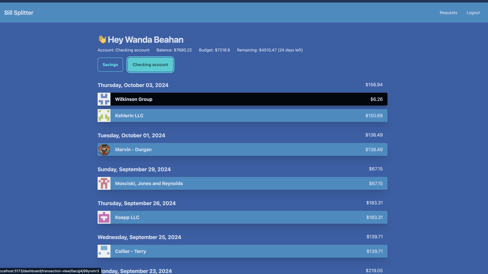

# interview-task-boilerplate

IcePanel engineering interview task boilerplate

## How to set up the project:

1. Install backend dependencies `pnpm install`
2. Start both Pocketbase and the express backend with `pnpm start`
3. Go to `http://127.0.0.1:8090/_/` and create an admin account and login
4. In a seperate terminal run `pnpm run seed` to seed our database with data to use
5. The seed document should provide you a email/password you can use.
6. In a seperate terminal run `pnpm start` on the `frontend/` folder

## AI Usage:

I only used ChatGPT for debugging and asking framework specific knowledge. Since I am not as familar with Vue ecosystem (Vue Router,Pinia) I used AI to guide me with these problems.

## Time Usage(Estimates):
* Initial investigation for Backend: 2hrs
* Building Authenication (FE/BE): 4hrs
* Building Dashboard View: 4hrs
* Building view to view transactions/bills: 4hrs
* Building UI for splitting Bills with Contacts friends: 6hrs

Total: 18+hrs

* All of the time usage went towards learning vue/express/pocketbase/pinia since it was my first time combining the tools together.

## What I did not have time to build:
* Did have time to build an UI so people can respond to their split requests (BE/FE)
* Was not able to build the view for viewing owners split requests.
* Tests
* A way to update the category of the bill (FE)
* A way to update notes of a bill (FE)

## What I wish I could work on more:
* Pagination for longer lists like transactions for the dashboard
* Pocketbase has realtime subscriptions that I was going to use to get real time updates with split bill requests
* Better desktop design, I built with mobile first, but I felt like the desktops screens had better usages for the space needed.
* Multi-step split bill screen so the user does not have to scroll down.
* Better accessibility (usage of semantic HTML and keyboard bindings)
* Better Dialog Confirmations and Tooltips
